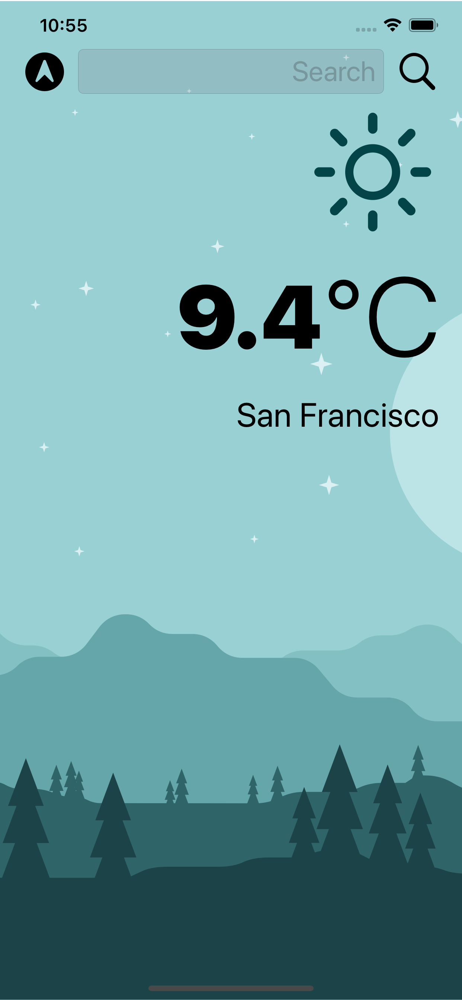

# Climate_iOS
This app is a personal project to train myself with the usage of APIs in Swift programming.
For this project I used a free API from **OpenWeatherAPI**, you can find their site here: [https://openweathermap.org], check it out, they offer a good service.

The app supports the Dark mode too.

